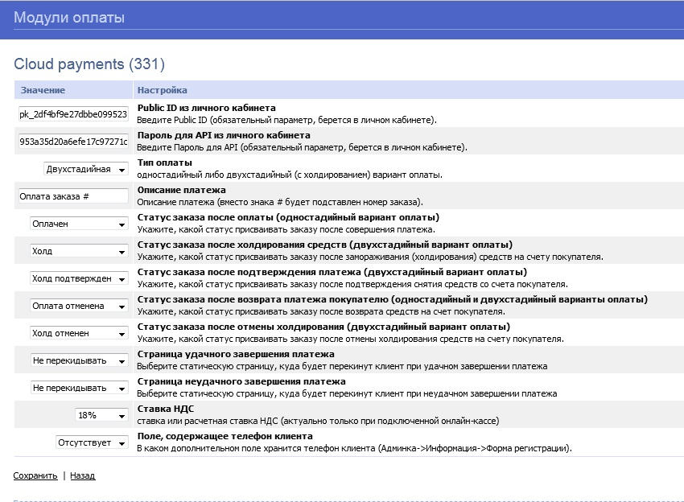

# CloudPayments модуль для ShopCMS
Модуль позволит с легкостью добавить на ваш сайт оплату банковскими картами через платежный сервис [CloudPayments](https://cloudpayments.ru).

### Возможности:  
• Одностадийная схема оплаты;  
• Двухстадийная схема оплаты;    
• Поддержка онлайн-касс (ФЗ-54);  
• Отправка чеков по email;  
• Отправка чеков по SMS;  

### Совместимость
* ShopCMS любая версия;

### Установка модуля 
Скопировать файлы:

helper_cloudpayments_ru.php -> /core/includes/  
cloudpayments_ru.php        -> /core/modules/payment/  
cloudpayments_ru.tpl.html   -> /core/modules/tpl/  

В аминистративной панели в "Модули->Модули оплаты" найти модуль "Cloudpayments" и инсталлировать его. 

Модуль "Оплата через Cloud payments (NN)" появится в списке установленных модулей. Нажмите "Редактировать".

- задайте PublicID (см.ниже)
- задайте Пароль для API (см.ниже)
- остальные настройки согласно вашему выбору.

Перейдите в "Настройки->Варианты оплаты" и подключите  установленный модуль оплаты. 

## Техническая настройка
### Личный кабинет CloudPayments
В личном кабинете CloudPayments в настройках сайта необходимо включить следующие уведомления:

"Настройки Сheck уведомлений": 
http://site.ru/index.php?cloudpayments_ru=Check
POST Windows-1251

"Настройки Pay уведомлений": 
http://site.ru/index.php?cloudpayments_ru=Pay
POST Windows-1251

"Настройки Confirm уведомлений":
http://site.ru/index.php?cloudpayments_ru=Confirm
POST Windows-1251

"Настройки Refund уведомлений":
http://site.ru/index.php?cloudpayments_ru=Refund
POST Windows-1251

"Настройки Cancel уведомлений":
http://site.ru/index.php?cloudpayments_ru=Cancel
POST Windows-1251

если сайт работает по HTTPS, то и уведомления тоже с https, а не с http.

Где domain.ru — доменное имя вашего сайта.
Во всех случаях требуется выбирать вариант по умолчанию: кодировка — UTF-8, HTTP-метод — POST, формат — CloudPayments
Данные URL можно скопировать из настройки модуля CloudPayments в панели администрирования ShopCMS

### Сервер с ShopCMS
 если в .htaccess задано Content-Security-Policy, то добавляем туда https://widget.cloudpayments.ru

Например, было:
Header set Content-Security-Policy "frame-src 'self' https://www.google.com;"
стало:
Header set Content-Security-Policy "frame-src 'self' https://www.google.com https://widget.cloudpayments.ru;"

 
Пример настройки ЛК:

